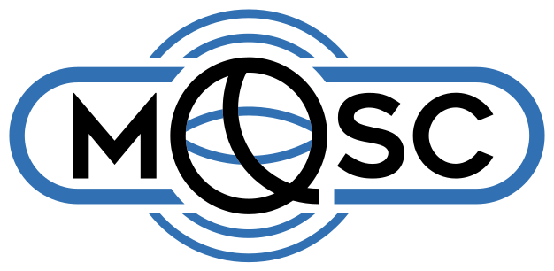

<!-- rumdl-disable MD033 MD041 -->
<p align="center">
  <a href="https://mq.sc/">
    <picture>
      <source media="(prefers-color-scheme: dark)" srcset="docs/_static/logo-mqsc-dark.svg">
      
    </picture>
  </a>
</p>

# IBM QDMI Device

[](LICENSE)
[](https://isocpp.org/)
[](https://cmake.org/)
[](https://github.com/munich-quantum-software/ibm-qdmi-device/actions/workflows/ci.yml)
[](https://codecov.io/gh/munich-quantum-software/ibm-qdmi-device)

**IBM QDMI Device** connects IBM Quantum Platform to the
[Quantum Device Management Interface (QDMI)](https://github.com/Munich-Quantum-Software-Stack/QDMI),
a vendor-neutral C API for quantum hardware. The C++20 library handles API-key
authentication, calibration queries, and the job lifecycle. It submits OpenQASM
3 circuits and returns ordered shots and histograms. Optional Qiskit and
PennyLane integrations use the same native interface.

Live metadata validation has passed; quantum execution has not yet been
validated on hardware. Examples default to local simulation.

<p align="center">
  <a href="https://ibm-qdmi-device.readthedocs.io/en/latest/">
    
  </a>
</p>
<!-- rumdl-enable MD033 MD041 -->

## Installation

Install from a source checkout with Python 3.11 or newer, a C++20 compiler,
CMake 3.24 or newer, and Git. Linux builds also require OpenSSL development
headers.

```console
uv venv
uv pip install .          # core library and Python entry points
uv pip install '.[qiskit]'  # adds the Qiskit backend (IBMBackend)
```

For C++ projects, follow the
[native installation guide](https://ibm-qdmi-device.readthedocs.io/en/latest/installation.html#native-package)
for CMake build and installation commands.

## Where to Start

| I want to…                                   | Guide                                                                                    |
| :------------------------------------------- | :--------------------------------------------------------------------------------------- |
| Run circuits from **Python / Qiskit**        | [Qiskit Integration](https://ibm-qdmi-device.readthedocs.io/en/latest/qiskit.html)       |
| Execute **PennyLane** QNodes                 | [PennyLane Integration](https://ibm-qdmi-device.readthedocs.io/en/latest/pennylane.html) |
| Walk through end-to-end workloads            | [Examples](https://ibm-qdmi-device.readthedocs.io/en/latest/examples.html)               |
| Integrate the **C++ library** directly       | [Usage Guide](https://ibm-qdmi-device.readthedocs.io/en/latest/api.html)                 |
| Understand the Python package's entry points | [Python Package](https://ibm-qdmi-device.readthedocs.io/en/latest/python_package.html)   |
| Contribute to the project                    | [Contributing](https://ibm-qdmi-device.readthedocs.io/en/latest/contributing.html)       |

## Contributing

Contributions are welcome, including bug reports, documentation improvements,
and new features. See the
[Contributing Guide](https://ibm-qdmi-device.readthedocs.io/en/latest/contributing.html)
for the development workflow, coding standards, and pull request process.

## License

The core C++ library and Python package are licensed under the
**Apache License 2.0 with LLVM exception**. See [LICENSE](LICENSE) for the
license text.
